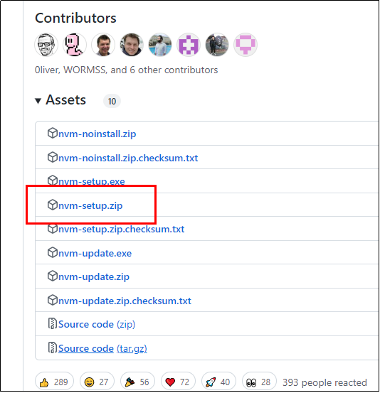
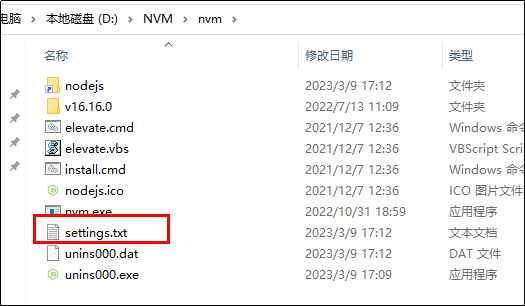
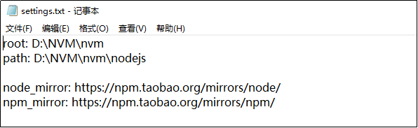
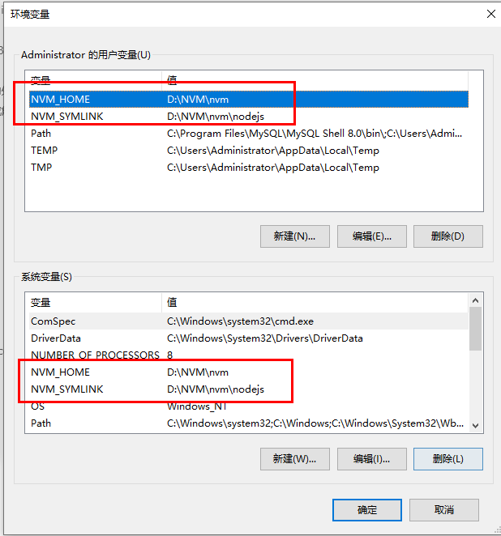
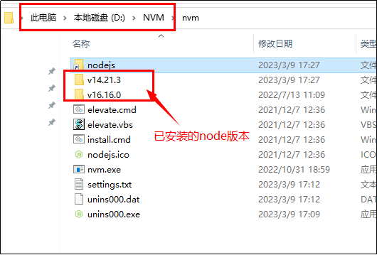
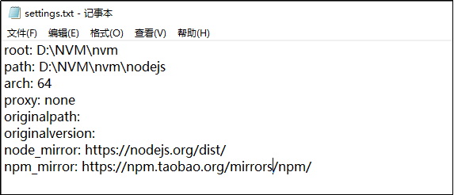

##### 1、安装nvm 
+ https://github.com/coreybutler/nvm-windows/releases


+ 点击.exe文件 -> accept -> nvm的安装路径 (D:\NVM\nvm) -> 创建nodejs文件放在D:\NVM\nvm下 -> 一直点击next安装完成

##### 2、给该文件添加这两行命令
node_mirror: https://npm.taobao.org/mirrors/node/
npm_mirror: https://npm.taobao.org/mirrors/npm/



##### 3、配置环境变量


##### 4、测试一下
```javascript
  nvm -v  // 查看当前版本
  nvm --config 
  nvm ls // 查看已下载的node版本
  nvm list // 查看已安装node版本列表
  nvm install 版本号  // 下载对应node版本, nvm install 16.16.0
  nvm use 版本号 // 切换node版本, nvm use 16.16.0
  nvm on  // 开启nvm
  nvm off  // 关闭nvm
  nvm list available  // 查看node所有可以下载的版本
  node -v  // 查看node版本
```

##### Tips: 如果原本电脑已安装某个版本的nodejs
* 在安装nvm会检测是否安装某个版本的nodejs, 并提示该版本是否需要被nvm管理，如果选择是，该node的安装路径会自动变到对应的nvm安装目录下

* 当"nvm install node版本"时报错，可以改一下node镜像


